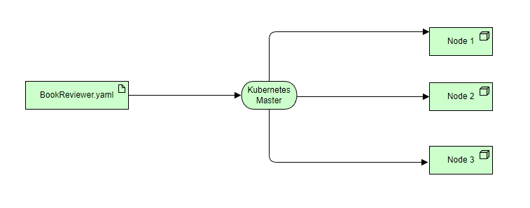

# BookReviewer

BookReviewer is a book rating system where anyone can rate a book.

##### Stack

* Java 17
* Spring Boot 3
* PostgreSQL 15.2
* Maven 3
* Docker

##### Application Information

The BookReviewer app is essentially a REST API application that provides five methods including book details and reviews.
More specifically the below methods are provided:
* /api/v1/books is a GET method that returns a list of Books given a search term that can be either a book title or an author name (caching also applied)
* /api/v1/books is a POST method that creates a new review
* /api/v1/books/{id} is a GET method that retrieves details about a book given the id including book details, average rating and reviews (caching also applied)
* /api/v1/books/monthly/{id} is a GET method that retrieves the average rating per month for a book given the id
* /api/v1/books/average is a GET method that retrieves a list of books based on their average rating given the size of results

Moreover, BookReviewer consumes the free Gutendex API (https://gutendex.com/) to retrieve Book Data
Lastly, the review data are stored in PostgreSQL database using the JPA persistence API

##### Application Execution

BookReviewer app is proposed to be executed using the docker compose tool, in order for all the services (Spring Boot with integrated Tomcat for the backend, PostgreSQL for the database)\
to be built and initialized with their intended configuration and order.

```
docker-compose -f .\docker.compose.yml build --no-cache
docker-compose -f .\docker.compose.yml up --build
```

##### Application Startup

After building the app, then navigate to:
```
http://localhost:8080/swagger-ui/index.html
```

##### Known issues

* The requirements claim that the search term for the books contains portion of the title but the Gutendex API also searches on the author name, hence this current version of the application searches also in author names, but code was also applied to filter only titles.
* The Book details cache should be invalidated when a new review is posted

##### Future Improvements

* Utilize a NoSQL database to replace Postgre
* More thorough unit testing to achieve e2e coverage
* Improve performance on JPA Queries
* Add authentication and user management
* Make it more scalable using Kubernetes

##### Mock Data

In order for the API to be tested at once, without having to create a lot of data first, some mock data are already persisted
and can be queried mostly to test the monthly average and top average methods using book ids: 1400, 1401, 1402, 1403

##### Scalability

The choice of preference to deploy this service in a more scalable way would be Kubernetes as it provides a powerful 
and flexible platform for deploying and managing scalable services with features for container orchestration, 
scalability, high availability, portability, and vast community support. For this reason in the high-level diagram below
the way to deploy the BookReviewer service using Kubernetes master and its worker nodes is described.



##### Editor notes

Kindly, keep in mind that I am not familiar in a production grade with Spring, but it was the choice of preference
because of the popularity of the framework, the community behind it and of course to demonstrate my capability to adapt to new areas.

